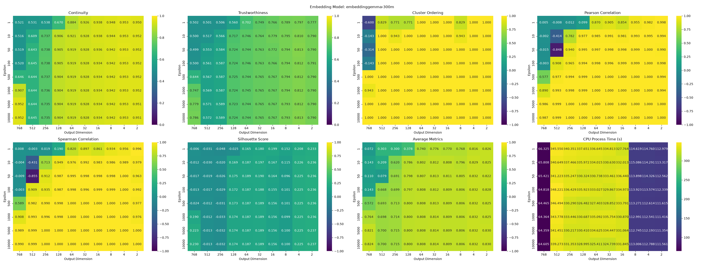

# Layer based system for differential privacy and dimensionality reduction

## Goal: Find out when is the best time to add noise for differential privacy to document embeddings





## Setup

Requirements: 
    
    - 16GB+ of avaliable system memory
    - GPU for embedding
    - CPU time
    Python 3.10+ virutal environment
`pip install -r requirements.txt`

## Supported Datasets

| Dataset | Classes | Source |
|---------|---------|--------|
| `news` (default) | Crime, Entertainment, Politics, Science | Local `cleanedData.csv` |
| `agnews` | World, Sports, Business, Sci/Tech | HuggingFace `ag_news` (120k train) |
| `yelp` | 1–5 stars | HuggingFace `yelp_review_full` (40k subset) |

## Steps

1. Clean the original news data with `preprocess/clean.py` to get rid of empty datapoints

2. **Download additional datasets** (AG News and Yelp):
    ```
    python preprocess/download_datasets.py               # downloads both
    python preprocess/download_datasets.py --dataset agnews   # AG News only
    python preprocess/download_datasets.py --dataset yelp     # Yelp only
    python preprocess/download_datasets.py --yelp-subset-size 10000  # custom subset size
    ```

3. Run one of the scripts in `embedding/` to save the documents as embeddings, using the `--dataset` flag:
    ```
    python embedding/save_bert.py --dataset news     # original dataset (default)
    python embedding/save_bert.py --dataset agnews   # AG News
    python embedding/save_bert.py --dataset yelp     # Yelp
    ```
    There are 5 embedding model options provided: bert, gemma, gemma3, qwen8b, vault. All support the `--dataset` flag.

4. Run the dimensionality reduction gridsearch with the `--dataset` flag (or auto-detected from the embedding file):
    ```
    python gridsearch.py -f embeddingdatabert-base-nli-mean-tokens_agnews.npz -r 1 -t PCA -s 0
    python gridsearch.py -f embeddingdatabert-base-nli-mean-tokens_yelp.npz -r 1 -t PCA -s 0
    ```
    - `-f`, `--embedding-file` Path to the embedding file
    - `-r`, `--runs` Number of runs to execute
    - `--run` used to run a specific run (for HPC systems or redoing specific runs)
    - `-t`, `--dr-type` The primary type of dimensionality reduction (DR) that happens in the first layer
    - `-t2` `--dr-type-secondary` The secondary type of DR that occurs after noise is added (default is the same as primary)
    - `-s` `--resolution` Changes the grid size resolution in a range of 0-4
    - `--no-plot` Removes the automatic plotting from the gridsearch script
    - `--dataset` Explicitly set dataset name (auto-detected from .npz if omitted)

    Results are saved to `runs/<dataset>/<embeddingModel>/<dimReductType>/`

5. Plot results with: `python plot_results.py -c runs/` 
    - Option 1: `-c` `--crawl` Crawls through a directory recursively to find all output files
    - Option 2: `-d` `--directory` Choose one directory to make into plots
    - Option 3: `-f` `--files` Choose files to add manually
    - `-o` `--output` Change output file name
    - `-ao` `--average-ouput` Change the average plot's file name

6. Compare graphs and find the best balance for the required epsilon

7. Make/edit a json layer file (examples in `examples/`) then run `python Factory.py path_to_json`
    - The layers are executed from top to bottom and there can be as many layers as needed.

## Output Directory Structure

```
runs/
  <dataset>/           # e.g., news, agnews, yelp
    <embedding_model>/
      <dim_reduct_type>/
        gridsearch_results_*.npz
        gridsearch_comparison.png
        gridsearch_comparison_average.png
```

## Dimensionality Reduction types:

    - PCA 
    - TSNE
    - LDA
    - SVD
    - MDS
    - LLE
    - SOM
    - UMAP

## Metrics

    - Contiunity
    - Trustworthiness
    - Cluster Ordering
    - Pearson Correlation
    - Spearman Correlation
    - Silhouette Score
    - Average of the above metrics
    - CPU Process time
    - Estimated number of clusters
    

## Resolutions: Epsilons | output dimensions

    - 0 [1,2] | [768,2]
    - 1 [1,10,50,100,500,1000] | [768,3,2]
    - 2 [1,10,50,100,500,1000] | [768,384,128,48,8,2]
    - 3 [1,10,50,100,500,1000,5000,10000] | [768,512,256,128,64,32,16,8,4,2]
    - 4 [.1,.5,1,5,10,25,50,100,250,500,1000,2500,5000,10000] | [768,512,256,128,96,64,32,16,12,8,6,4,3,2]
    - 5 [1,10,50,100,500,1000,5000,10000] | [categories-1, ..., 2] (adaptive for algorithms like LDA and TSNE)
